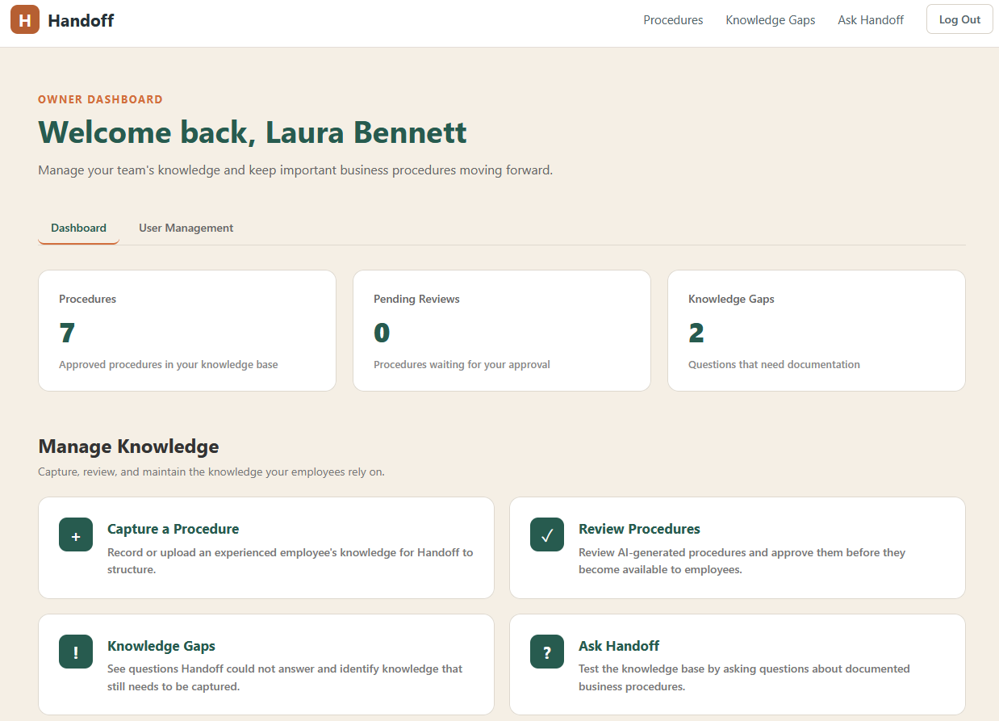
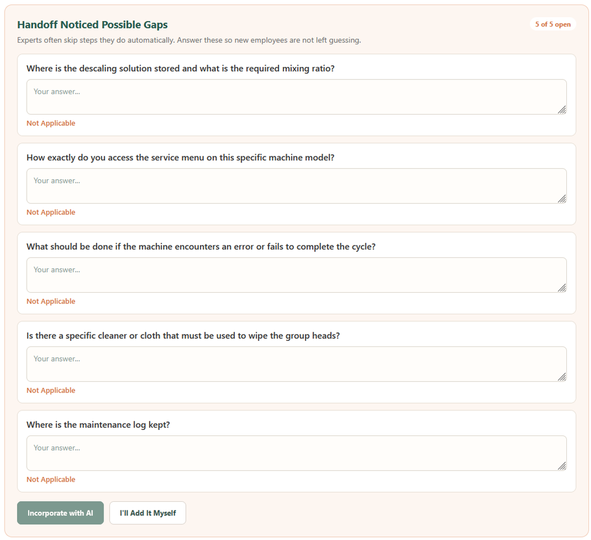
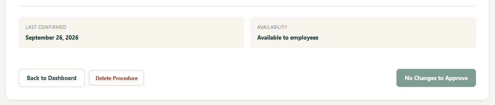
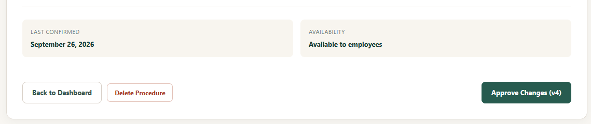
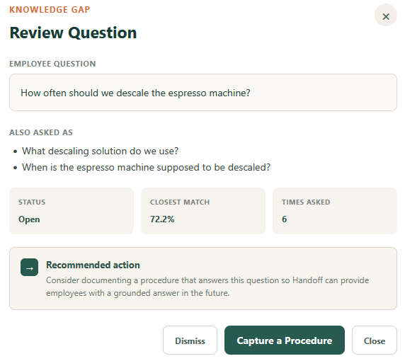
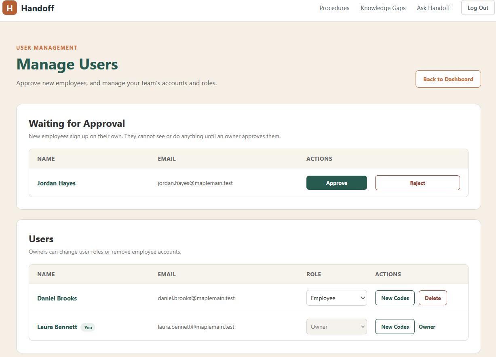
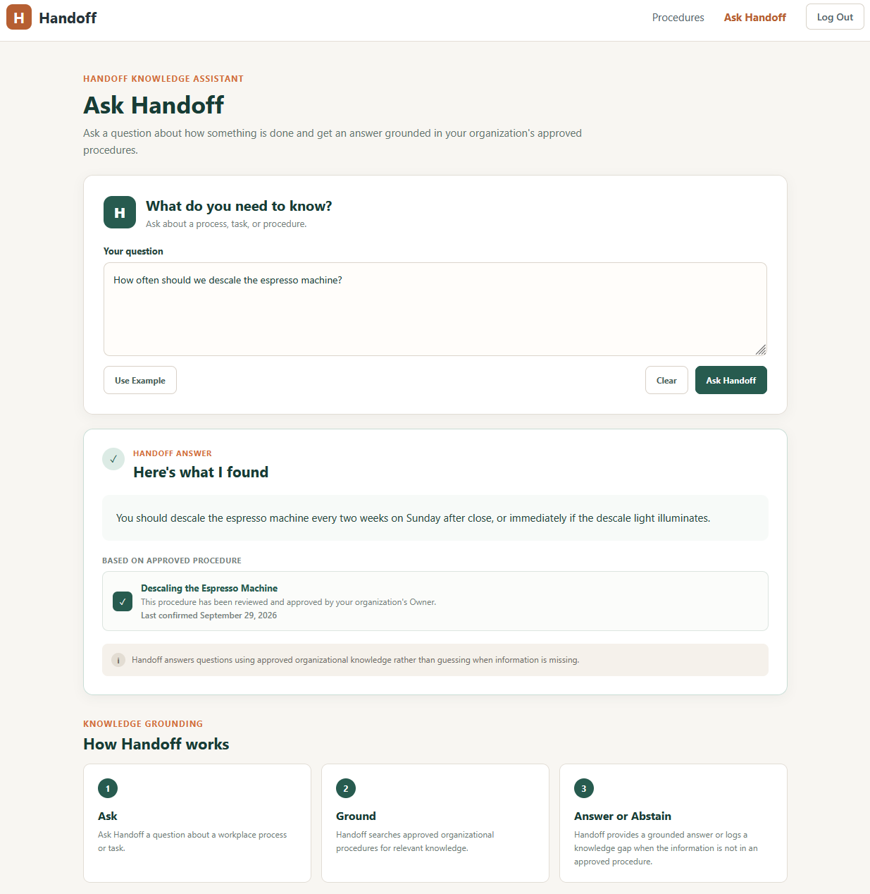

# Handoff User Guide

Handoff has two kinds of accounts:

- **Owners** capture procedures, review and approve them, approve new employees, and see the questions employees could not get answered.
- **Employees** ask questions and read approved procedures.

## Getting started

**The first account becomes the owner.** Open Handoff, choose to sign up, and enter your name, email, a password, and your business name.

**Employees sign up, then wait for approval.** Employees sign up with their name, email, and a password. The account stays pending, and cannot sign in or see anything, until an owner approves it (see [Approve new employees](#7-approve-new-employees)).

Passwords need at least 12 characters, with uppercase and lowercase letters, a number, and a special character. The signup page shows a checklist that updates as you type. A sign-in lasts 8 hours (one work shift).

**Save your recovery codes.** The first time you sign in, Handoff shows eight recovery codes, once. Copy them, download them as a text file, or write them down, and keep them somewhere safe. Each code can reset a forgotten password one time.

**Forgot your password?** On the login page, select **Forgot password?**, then enter your email, one recovery code, and a new password twice. Each code works once. Resetting your password also signs you out anywhere else you were still signed in. If you have lost your codes, ask an owner for a new set.

**Too many wrong attempts.** After 5 wrong passwords or recovery codes in a row, sign-in is paused for 15 minutes. The message is the same whether or not an email has an account, so Handoff never reveals who has one.

## For owners

### The owner dashboard

The dashboard shows three counts: **Procedures** (approved and searchable), **Pending Reviews** (drafts waiting for your approval), and **Knowledge Gaps** (open questions employees asked that Handoff could not answer). Below them are shortcuts to Capture a Procedure, Review Procedures, Knowledge Gaps, and Ask Handoff.

### 1. Capture a procedure

Choose **Capture a Procedure** on the dashboard, or **+ Add Procedure** on the Procedures page. Give the procedure a title, then pick how to provide it:

- **Record Audio**: select **Start Recording**, explain the procedure in your own words, then **Stop Recording**. Use **Record Again** to start over.
- **Upload Audio**: select **Choose Audio File** and pick an existing recording (up to 10 MB).
- **Enter Manually**: type or paste written notes.

Select **Submit for AI Structuring →**. Handoff transcribes any audio, then organizes it into numbered steps and warnings.

**If something goes wrong after the recording was transcribed**, Handoff moves the transcript into the Enter Manually box and tells you so. Read it over, fix anything misheard, and submit again. The recording is not transcribed a second time.

### 2. Review the draft

The draft opens on the Procedure Review page. Nothing you capture is visible to employees until you approve it.

- Edit any step or warning directly. Use **+ Add Step** and **+ Add Warning** to add more, or **×** to remove one.
- **Handoff Noticed Possible Gaps** lists up to five questions about things the recording may have skipped, such as what to do if something goes wrong. For each question you can:
  - Type an answer, then select **Incorporate with AI** to have Handoff add it as new steps. **Undo AI Changes** reverses the last merge.
  - Select **I'll Add It Myself** and edit the steps yourself.
  - Select **Not Applicable** if the question does not apply. **Reopen** brings a question back.

**Handoff can add steps, but it can never change yours.** When it incorporates your answers, Handoff checks that every one of your original steps comes back word for word and in order. If the AI rewrote anything, the merge is cancelled and your procedure is left untouched.

### 3. Approve

**Approve Procedure** becomes available once every gap question is handled. Approving makes the procedure searchable. If it answers questions employees had already asked, Handoff tells you how many knowledge gaps it resolved.

### 4. Update a procedure

Open it from the Procedures page with **Review**. The approve button reads **No Changes to Approve** until you edit something, then **Approve Changes (v2)** (or the next version number). Approving an update raises the version and updates the procedure's Last Confirmed date, which employees see with every answer.

### 5. Delete a procedure

Open the procedure (or draft) from the Procedures page with **Review**, select **Delete Procedure**, and confirm. Deleting is permanent. Any knowledge gaps the procedure had resolved become open again, because nothing answers them anymore.

### 6. Knowledge gaps

When an employee asks something Handoff cannot answer, the question appears on the **Knowledge Gaps** page. This is your to-do list for what to document next.

Each card shows:

- **Asked N times**: questions with the same meaning are grouped, so the most-needed answers rise to the top.
- **Last asked**: when someone most recently asked it.
- **Closest match**: how close the best existing procedure came. A high percentage usually means a procedure covers the topic but not this exact question.

Select **Review** on a card to see its details, including **Also Asked As**: every different wording employees used. Grouping is automatic and can occasionally combine two different questions on the same topic, so each wording is kept for you to read.

A gap is:

- **Open** until something answers it.
- **Resolved** automatically when you approve a procedure that answers it. The card shows which procedure resolved it.
- **Dismissed** when you select **Dismiss** because it does not need an answer. If an employee asks it again later, it appears as a new open gap.

Use **Search questions** and **Show** (All, Open, Resolved, Dismissed) to filter the list. Search matches each gap's main question.

### 7. Approve new employees

On the owner dashboard, select the **User Management** tab. New signups appear under **Waiting for Approval**.

- **Approve**: the person can sign in right away.
- **Reject**: deletes the pending account.

Check that each name is someone you actually hired before approving. Pending accounts cannot see or do anything, and up to 20 can wait at once. If someone signs up with an email that already has an account, they see the usual "waiting for approval" message but no new request appears, so signup can never be used to find out who has an account.

### 8. Manage users

The **Users** list on the same page shows everyone who can sign in.

- **Role**: change a person between **Employee** and **Owner**. Handoff asks you to confirm first, because owners can approve and delete procedures, see knowledge gaps, and manage every account.
- **New Codes**: create a fresh set of recovery codes for someone who lost theirs. The codes are shown once; give them to the person directly. Their old codes stop working immediately.
- **Delete**: permanently remove an employee's account. They lose access on their very next action, even if Handoff is still open on their screen.

You cannot change your own role, so a business always keeps at least one owner. Owner accounts cannot be deleted; change the person to Employee first.

**Keep a second owner.** Give a trusted person, such as a shift manager, the Owner role. Then someone can always approve new employees and issue recovery codes while you are away.

**If every owner is locked out**, for example a sole owner who lost both their password and their recovery codes, whoever runs the Handoff server can issue new codes. See [Troubleshooting](INSTALL.md#troubleshooting) in the install guide.

## For employees

### Ask Handoff

Select **Ask Handoff**, type a question in your own words, and press **Enter** or select the **Ask Handoff** button. **Shift+Enter** adds a new line. **Use Example** fills in a sample question, and **Clear** starts over.

You will see one of three results:

- **An answer**, with the name of the procedure it came from and the date the owner last confirmed it. Handoff answers only from procedures the owner approved.
- **"Not documented"**, when no approved procedure contains the answer. Handoff does not guess. Your question is sent to the owner as a knowledge gap, so it can be documented.
- **"Temporarily unavailable"**, when the AI service is busy or has reached its usage limit. Nothing was recorded; wait a moment and ask again.

### Tips for good results

- Ask one thing at a time: "What temperature should the milk fridge be?" works better than several questions in one.
- Be specific: name the equipment, task, or situation.
- If you get "not documented" for something you believe is written down, try different words. Handoff matches meaning, but a very different word can still miss. The owner also sees these questions and can add the words employees actually use.

### Read procedures

**Procedures** lists every approved procedure. Select **View** to read one from start to finish, including its warnings. Drafts the owner has not approved are never shown to employees.

## Frequently asked questions

**I signed up but cannot sign in.**
Your account is waiting for an owner to approve it. Ask your manager or the business owner.

**I forgot my password and lost my recovery codes.**
Ask an owner to select **New Codes** next to your name in User Management, then use one of the new codes under **Forgot password?**.

**Why didn't Handoff answer a question when the procedure clearly covers it?**
Usually the wording. In testing, "What time does the cafe open?" was answered, but "What time does the store open?" fell just short, because the procedure only said "cafe." The question appeared as a knowledge gap, the owner added "store" to the procedure, and approving it resolved the gap automatically.

**Why does Handoff sometimes say "not documented" instead of giving a close answer?**
On purpose. A wrong answer about a safety step or a refund rule is worse than no answer. Handoff answers only when an approved procedure actually contains the answer, and turns every other question into a gap the owner can fill.

**Can the AI change a procedure by itself?**
No. The AI drafts and suggests, but only the owner approves, and code blocks the AI from rewriting the owner's own steps.