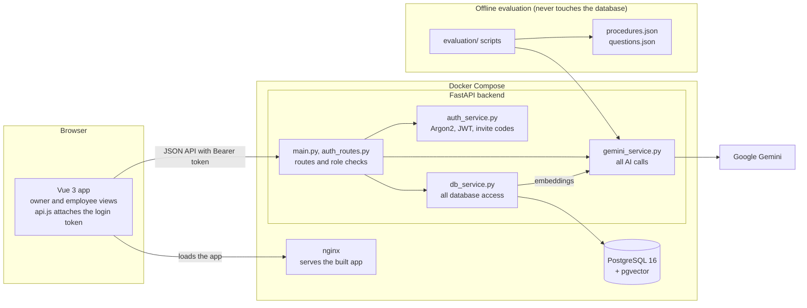
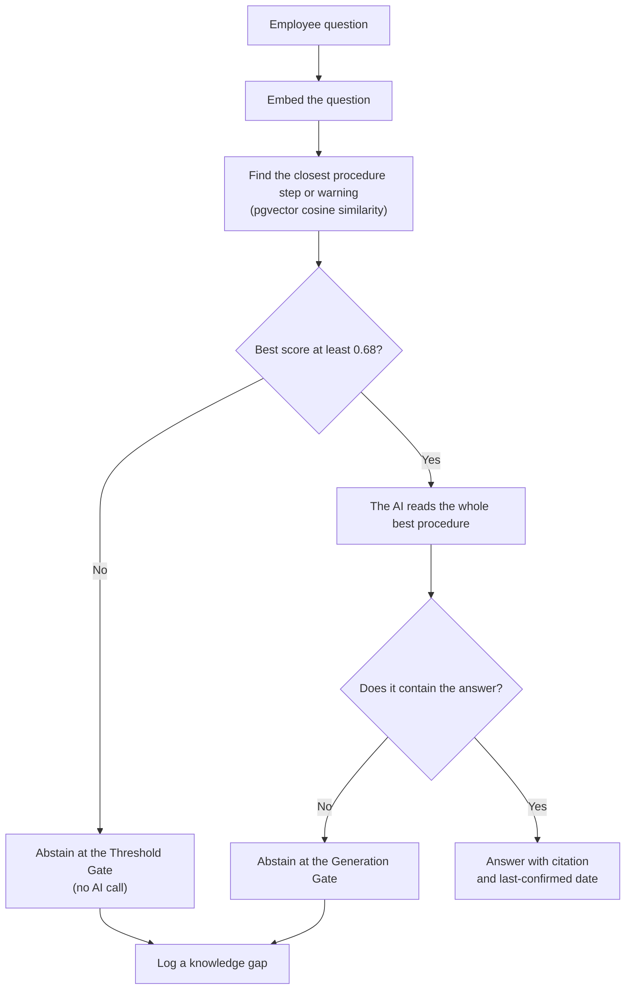
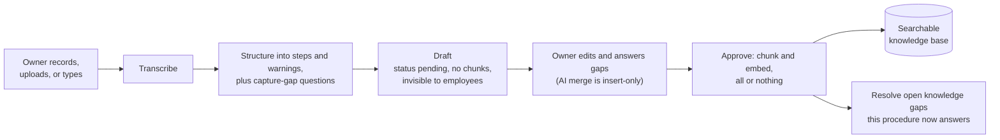
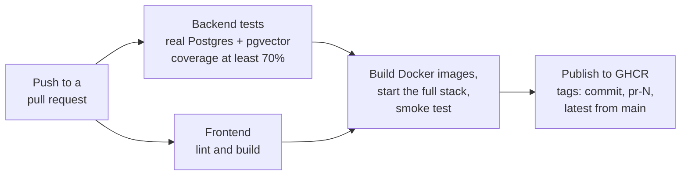

# Handoff Architecture

Handoff is a Vue 3 single-page app, a FastAPI backend, and PostgreSQL with the pgvector extension, packaged with Docker Compose. Google Gemini provides transcription, structuring, answers, and embeddings. Two rules shape the design: **the AI never writes to the database directly**, and **nothing reaches employees without owner approval**.

## Components

- **`gemini_service.py` is the only module that talks to Gemini.** It retries temporary provider errors and translates quota and outage errors into Handoff's own error types, so changing AI providers touches one file.
- **`db_service.py` is the only module that talks to the database.** Routes never run queries themselves.
- **The browser calls the API directly** (port 8000). nginx only serves the built app, with security headers and a fallback so page refreshes work.

## Answering a question: two abstention gates

Retrieval compares the question with every step and warning separately (`procedure_chunks`), then hands the whole winning procedure to the AI. Both gates are needed: in the evaluation, "How often should we descale the espresso machine?" scored 0.722, above the threshold, because it is on topic for the espresso cleaning procedure, which never says how often to descale. Only the Generation Gate stops it. See [evaluation/README.md](../../evaluation/README.md).

## Capturing knowledge: from recording to approval

- **The Approval Gate is enforced three times:** drafts have no chunks, so search cannot find them (database); employees get 404 for drafts (API); and the review page is owner-only (UI).
- **The insert-only guardrail:** when the AI merges the owner's answers, code checks that every original step comes back word for word and in order, and rejects the merge otherwise.
- **Approval is all or nothing:** embeddings are generated before anything is saved, so a failed AI call leaves the database unchanged.

## Knowledge gap lifecycle

- **Grouping:** a new unanswered question joins an open gap when their similarity is at least 0.75. The gap stays open, and its "Asked N times" count goes up. Every distinct wording is kept ("Also Asked As"), because topic similarity cannot always tell two different questions apart.
- **Dismissed gaps stay dismissed.** If an employee asks the same thing later, it opens a new gap, so a dismissal never silently swallows future questions.
- **Auto-resolve** uses the same test as the Threshold Gate. Adding the Generation Gate here is planned (see Limitations in the [README](../../README.md#known-limitations)).
## Delivery: CI/CD

The images published are the exact images that passed the smoke test. Publishing uses a short-lived token with only the package permission it needs.

## Key design decisions

| Decision | Why | Alternative considered |
|---|---|---|
| Embed each step and warning separately | One embedding per procedure diluted its meaning; chunking raised correct retrieval from 26 of 28 to 28 of 28 and best accuracy from 83% to 98% | Whole-procedure embeddings, with and without task types |
| Two abstention gates | No threshold alone stops on-topic, undocumented questions without blocking real answers | Threshold only |
| Answer threshold 0.68 | Midpoint of the measured gap between the highest near miss (0.670) and lowest correct answer (0.691) | 0.70, the original guess |
| Insert-only AI merge | The owner's words are authoritative; the AI may add, never rewrite | Trusting the AI's full rewrite |
| Keep every question wording | Grouping measures topic, not intent; a wrong merge must never hide a question | Picking a stricter grouping threshold |
| All AI calls in one module | Provider changes and error handling live in one place | Calling Gemini from each route |
| JWT, Argon2, invite codes; user reloaded every request | Role changes and deletions take effect immediately | Server sessions |
| Idempotent migrations on startup | Small schema changes, safe to rerun on every container start | Alembic (the choice at larger scale) |
| Hard delete, reopening resolved gaps | Simple and honest for a small business | Archiving, which keeps an audit trail but touches every query |
| Non-root containers, no secrets in images | Least privilege; `.env` is excluded from every build | Default root containers |

## Data model

| Table | Holds |
|---|---|
| `business` | The business name and its invite code |
| `users` | Name, email, Argon2 password hash, and role (owner or employee) |
| `procedures` | Title, steps, warnings, status (pending or approved), version, last-confirmed date, capture method, and the capture-gap questions asked |
| `procedure_chunks` | One row per step or warning, with its 3,072-dimension embedding; deleted automatically with its procedure |
| `gaps` | An unanswered question, its embedding, closest match, times asked, other wordings, status, and the procedure that resolved it |

All timestamps are stored with time zones (UTC).

## At larger scale

- **Vector index:** retrieval currently compares against every chunk, which is fast at this size. A pgvector HNSW index needs 2,000 dimensions or fewer for the `vector` type, so it would require `halfvec` or shorter embeddings.
- **Top-k retrieval:** sending the best two or three procedures to the AI would help questions whose answers span procedures.
- **Migrations:** Alembic instead of startup migrations.
- **Multiple businesses:** each install currently serves one business.

## Original design (Week 4)

`Capstone-Handoff.drawio` and `Capstone-Handoff.drawio.png` are the original component diagram from the design phase, kept to show how the architecture evolved. Since then the system gained authentication, the database-enforced Approval Gate, capture gaps, chunked retrieval, the second abstention gate, the knowledge gap loop, and the Docker and CI/CD pipeline.

To open it: download `Capstone-Handoff.drawio`, go to https://app.diagrams.net, choose **Device**, then **Open Existing Diagram**.