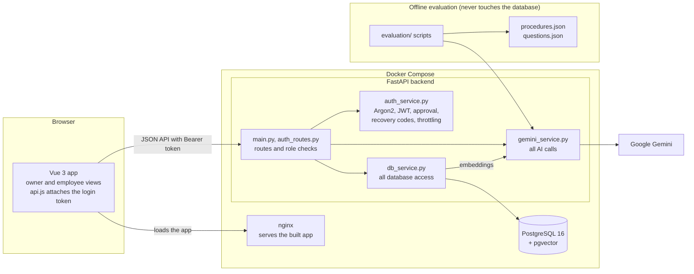
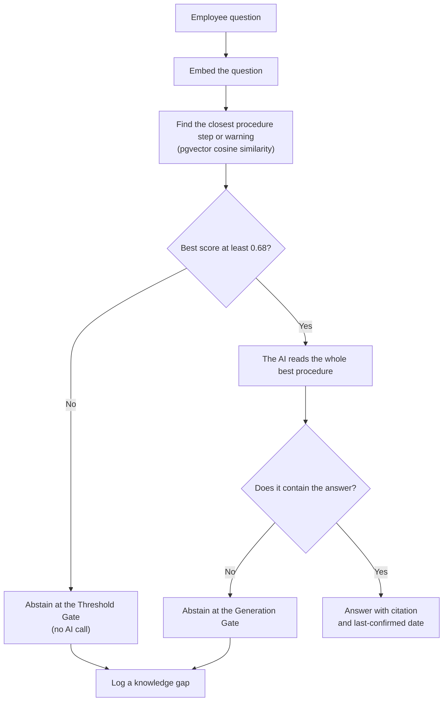
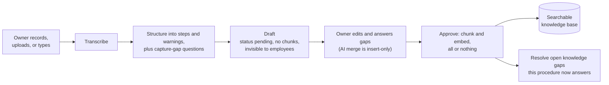
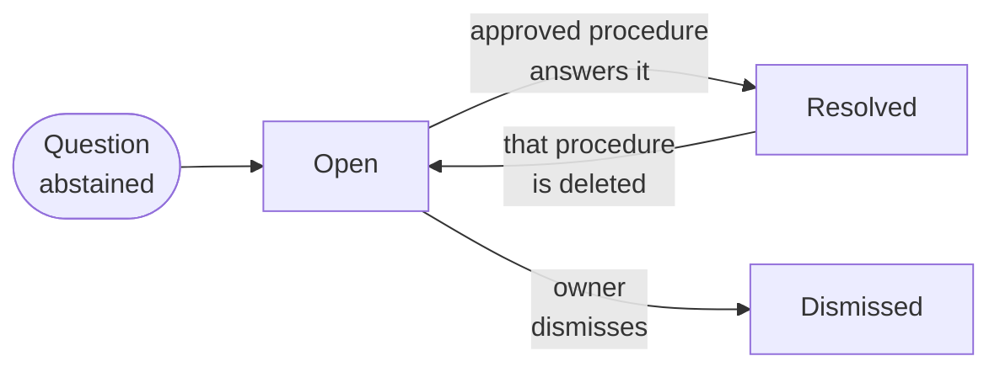
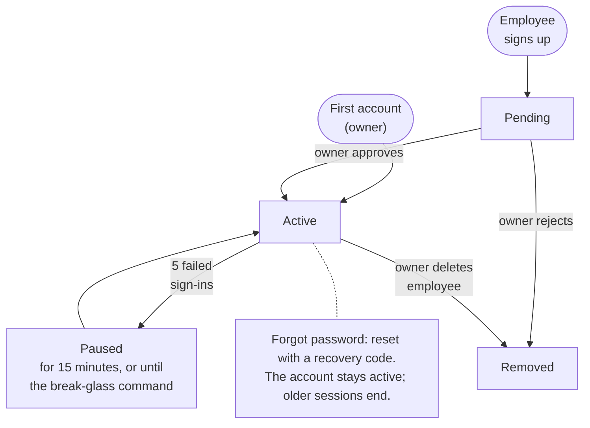
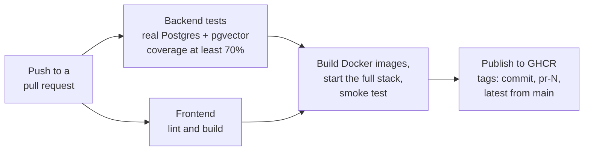

# Handoff Architecture

Handoff is a Vue 3 single-page app, a FastAPI backend, and PostgreSQL with the pgvector extension, packaged with Docker Compose. Google Gemini provides transcription, structuring, answers, and embeddings. Two rules shape the design: **the AI never writes to the database directly**, and **nothing reaches employees without owner approval**.

## Components

- **`gemini_service.py` is the only module that talks to Gemini.** It retries temporary provider errors and translates quota and outage errors into Handoff's own error types, so changing AI providers touches one file.
- **`db_service.py` is the only module that talks to the database.** Routes never run queries themselves.
- **The browser calls the API directly** (port 8000). nginx only serves the built app, with security headers and a fallback so page refreshes work.

## Answering a question: two abstention gates

Retrieval compares the question with every step and warning separately (`procedure_chunks`), then hands the whole winning procedure to the AI. Both gates are needed: in the evaluation, "How often should we descale the espresso machine?" scored 0.722, above the threshold, because it is on topic for the espresso cleaning procedure, which never says how often to descale. Only the Generation Gate stops it. See [evaluation/README.md](../../evaluation/README.md).

## Capturing knowledge: from recording to approval

- **The Approval Gate is enforced three times:** drafts have no chunks, so search cannot find them (database); employees get 404 for drafts (API); and the review page is owner-only (UI).
- **The insert-only guardrail:** when the AI merges the owner's answers, code checks that every original step comes back word for word and in order, and rejects the merge otherwise.
- **Approval is all or nothing:** embeddings are generated before anything is saved, so a failed AI call leaves the database unchanged.

## Knowledge gap lifecycle

- **Grouping:** a new unanswered question joins an open gap when their similarity is at least 0.75. The gap stays open, and its "Asked N times" count goes up. Every distinct wording is kept ("Also Asked As"), because topic similarity cannot always tell two different questions apart.
- **Dismissed gaps stay dismissed.** If an employee asks the same thing later, it opens a new gap, so a dismissal never silently swallows future questions.
- **Auto-resolve** uses the same test as the Threshold Gate. Adding the Generation Gate here is planned (see Limitations in the [README](../../README.md#known-limitations)).

## Account lifecycle

- **Pending accounts** cannot sign in or see anything, and at most 20 can wait at once.
- **The pause is temporary on purpose.** A permanent lock would let anyone who knows an email lock that person out for good.
- **A reset ends older sessions.** Resetting a password records when it changed, every token issued before that is refused, and the browser checks once per page load.
- **Break-glass:** `python -m backend.reset_password <email>` on the server unlocks the account and prints new recovery codes.
- **Changes apply on the next request.** Each request reloads the user from the database, so approvals, role changes, and deletions take effect immediately.

## Delivery: CI/CD

The images published are the exact images that passed the smoke test. Publishing uses a short-lived token with only the package permission it needs.

## Key design decisions

| Decision | Why | Alternative considered |
|---|---|---|
| Embed each step and warning separately | One embedding per procedure diluted its meaning; chunking raised correct retrieval from 27 of 29 to 29 of 29 and best accuracy from 84% to 98% | Whole-procedure embeddings, with and without task types |
| Two abstention gates | No threshold alone stops on-topic, undocumented questions without blocking real answers | Threshold only |
| Answer threshold 0.68 | Midpoint of the measured gap between the highest near miss (0.670) and lowest correct answer (0.691) | 0.70, the original guess |
| Insert-only AI merge | The owner's words are authoritative; the AI may add, never rewrite | Trusting the AI's full rewrite |
| Keep every question wording | Grouping measures topic, not intent; a wrong merge must never hide a question | Picking a stricter grouping threshold |
| All AI calls in one module | Provider changes and error handling live in one place | Calling Gemini from each route |
| Owner approval instead of a shared invite code | A shared code is a long-lived secret anyone can pass on; approval makes every account a per-person owner decision | Invite codes (the original design), single-use codes |
| Recovery codes plus a server break-glass command | Self-service recovery without an email provider; codes are stored with Argon2, as NIST SP 800-63B requires for codes under 112 bits of entropy | Email reset (future work); security questions (rejected, NIST SP 800-63B) |
| JWT, user reloaded every request, tokens older than a password reset refused | Role changes, deletions, and resets take effect immediately | Server sessions |
| Temporary 15-minute pause after 5 failures, one generic message | Stops password guessing without letting an attacker lock an owner out for good, and never reveals which emails exist | Permanent lockout; showing remaining attempts |
| Idempotent migrations on startup | Small schema changes, safe to rerun on every container start | Alembic (the choice at larger scale) |
| Hard delete, reopening resolved gaps | Simple and honest for a small business | Archiving, which keeps an audit trail but touches every query |
| Non-root containers, no secrets in images | Least privilege; `.env` is excluded from every build | Default root containers |

## Data model

| Table | Holds |
|---|---|
| `business` | The business name |
| `users` | Name, email, Argon2 password hash, role (owner or employee), status (pending or active), failed sign-in count and pause time, and when the password last changed |
| `recovery_codes` | One-time recovery codes, stored only as Argon2 hashes, with when each was used; deleted automatically with the account |
| `procedures` | Title, steps, warnings, status (pending or approved), version, last-confirmed date, capture method, and the capture-gap questions asked |
| `procedure_chunks` | One row per step or warning, with its 3,072-dimension embedding; deleted automatically with its procedure |
| `gaps` | An unanswered question, its embedding, closest match, times asked, other wordings, status, and the procedure that resolved it |

All timestamps are stored with time zones (UTC).

## At larger scale

This section answers the Unit 3 design feedback: how Handoff would serve 10,000 concurrent users. **It is a design, not something built or load-tested.** Today each service runs as a single container, which suits one small business. The point of this design is that the current architecture can grow into it without a rewrite.

**The real bottleneck is the AI provider, not our servers.** If 10,000 signed-in users each asked one question every 10 minutes, that would be about 1,000 questions a minute. Each one needs an embedding call, and most need a generation call. The Gemini free tier allows 15 generation requests a minute, so production would need a paid tier first.

| Layer | Today | At 10,000 concurrent users |
|---|---|---|
| Traffic | One backend container | A load balancer spreading requests across several backend containers |
| API servers | One server process per container | Several worker processes per container, and more containers as load grows. This works because the API is stateless: sign-in uses signed tokens rather than server-side sessions, and login throttling counts live in the database, so any container can serve any request |
| Database connections | SQLAlchemy's built-in pool in each process | Pool sizes set so that containers times workers times pool size stays under PostgreSQL's connection limit, with PgBouncer in front of the database |
| Slow AI work | Transcription, structuring, and merging run inside the request | A job queue (for example, Redis with background workers), so API workers stay free and the browser checks back for the result |
| Repeated questions | Every question is embedded and answered fresh | A cache of question embeddings and answers, cleared whenever a procedure is approved or deleted |
| AI provider limits | Free tier, with retry and clear error messages | A paid tier, a quota per business, and the job queue smoothing out bursts |
| Retrieval | Every chunk is compared with the question | A pgvector HNSW index, which needs 2,000 dimensions or fewer for the `vector` type, so it would require `halfvec` or shorter embeddings |
| Abuse protection | Sign-in pauses per account | Throttling per address as well, at the load balancer |

Other changes at this scale:

- **Top-k retrieval:** sending the best two or three procedures to the AI would help questions whose answers span procedures.
- **Migrations:** Alembic instead of startup migrations.
- **Multiple businesses:** each install currently serves one business.
- **Proof before promises:** a load test (for example, with k6 or Locust) would confirm these limits before any capacity claim is made.

## External-service resilience

Handoff depends on one outside service, Google Gemini, for transcription, structuring, embeddings, and answers. The strategy is to retry only what can succeed, tell the truth when it cannot, and never lose the user's work.

- **One module owns every AI call** (`backend/gemini_service.py`), so retry and error handling live in one place, and changing providers touches one file.
- **Temporary failures are retried with exponential backoff.** When Google is briefly overloaded, the call waits a little longer between each attempt.
- **Quota errors and bad requests are not retried.** Retrying them only wastes time and quota.
- **Errors become clear responses.** A usage limit returns `429` and an outage returns `503`, each with a message the user can act on. The app never shows a raw Google error.
- **Outages are reported honestly.** If the AI fails while answering, Handoff does not claim it logged a knowledge gap, and it does not guess an answer.
- **Work is never lost.** If structuring fails after a recording was transcribed, the transcript moves into the text box, so a retry skips transcription.
- **AI output is checked, not trusted.** JSON mode keeps responses well-formed, and the insert-only check rejects any merge that rewrites the owner's steps.
- **Models are configurable** in `.env`, so a model change or retirement needs no code change.

Next steps: request timeouts, a circuit breaker that pauses AI calls during a long outage, and a fallback model or provider.

## Technical debt: repaid and deferred

This section answers the Unit 5 feedback: which debt was repaid, and what each deferred item costs if it stays unresolved.

### Repaid

| Debt | How it was repaid | Pull request |
|---|---|---|
| Drafts stored only in the browser, which caused a review-page bug | Drafts saved in the database, with the Approval Gate enforced by the server | #5 |
| Timestamps stored without time zones, shown hours off | Converted to time-zone-aware columns with a migration that is safe to rerun | #5 |
| A JWT secret published in `.env.example` | Rotated, then removed from the example; a missing secret now stops the app instead of running insecurely | #5, #6 |
| An AI endpoint that answered without a login | Login required, plus a test that checks every route, including future ones | #6 |
| A database layer at 25% test coverage | Integration tests against a real PostgreSQL database, raising it above 90% | #5 to #9 |
| A shared invite code that never expired | Replaced with owner approval of every new account | #10 |
| Employees unable to open procedures the user guide promised | A read-only procedure view, with a test | #10 |
| An unused page, outdated comments, and mismatched numbers in the docs | Removed or corrected | #11 |

### Deferred

| Debt | Cost of leaving it unresolved |
|---|---|
| Auto-resolve uses only the first answer gate | **Reliability.** A gap can be marked resolved when nothing answers it. This happened in testing: approving an edit to Closing the Cafe falsely resolved the descale gap, which would hide a real employee question from the owner |
| No database retry at startup | **Reliability.** After a reboot, the backend can start before the database and fail until the restart policy brings it back |
| Sign-in throttling per account only | **Security.** An attacker can try one common password across many accounts without triggering any account's pause |
| No Content-Security-Policy header | **Security.** The session token lives in browser storage, so any future script-injection flaw could steal it; a CSP limits the damage |
| One shared HS256 signing secret | **Security.** Anyone holding the secret can create valid tokens, and rotating it signs everyone out |
| No audit log | **Security and maintenance.** There is no record of who approved, deleted, or changed what |
| No automated frontend tests | **Maintenance.** Interface regressions are caught only by the manual walkthrough. The server enforces every rule, so they cannot become security bugs |
| Startup migrations instead of Alembic | **Deployment.** There is no way to roll a schema change back, and the risk grows with the schema |
| No email | **Support.** A user who loses their recovery codes needs the owner or the server administrator to get back in |

## Original design (Week 4)

`Capstone-Handoff.drawio` and `Capstone-Handoff.drawio.png` are the original component diagram from the design phase, kept to show how the architecture evolved. Since then the system gained authentication, the database-enforced Approval Gate, capture gaps, chunked retrieval, the second abstention gate, the knowledge gap loop, and the Docker and CI/CD pipeline.

To open it: download `Capstone-Handoff.drawio`, go to https://app.diagrams.net, choose **Device**, then **Open Existing Diagram**.